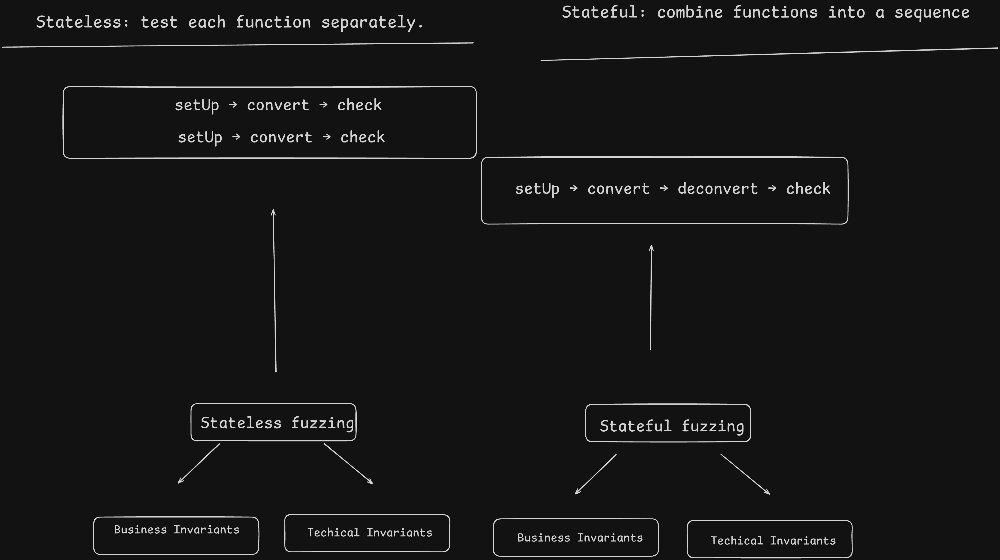

# Katana Vault Bridge — Invariant-Fuzzing Case Study

> Educational, reproducible test methodology. All tests use local mocks and a local EVM. This document does not claim a production vulnerability.



## Objective

The repository demonstrates a two-layer audit method for a vault bridge:

1. **Stateless fuzzing** resets the fixture for every input and probes one boundary or function at a time.
2. **Stateful fuzzing** keeps the state produced by earlier calls and executes a sequence of actions, checking invariants after every action.

Each assertion is labelled as either a **technical invariant** (state, permissions, bounds and conservation) or a **business invariant** (the protocol promise made to users).

## Flow under test

```text
Primary chain:  underlying → VaultBridgeToken → migration/bridge message
Secondary:     message → NativeConverter or CustomToken → user balance
Agglayer path: bridge/native converter → GenericCustomTokenAgglayer
Migration:     configure pair → receive message → complete migration
```

The stateful handlers generate normal, boundary, invalid, extreme and round-trip actions. Reverting calls are caught deliberately; a reverting malformed call must not change the tracked state.

## Invariant matrix

### `test/invariant/KatanaVaultBridgeStatefulInvariant.t.sol`

Flow: `convert → deconvert → round-trip → invalid input → interleaved conversion → bridge-out → extreme values`.

- `invariant_nativeBackingMatchesTokenBalance`: `backing = balanceOf(converter)`.
- `invariant_customSupplyMatchesBacking`: `totalSupply(customToken) = backing`.
- `invariant_oneToOneConversion`: `customTokenSupply = secondaryBacking`.
- `invariant_converterNeverHoldsLessThanBacking`: `tokenBalance(converter) ≥ backing`.
- `invariant_handlerBalanceIsBoundedBySupply`: `balance(handler) ≤ totalSupply`.
- `invariant_maxDeconvertCannotExceedBalance`: `maxDeconvert(handler) ≤ balance(handler)`.

The per-action technical bundle repeats balance/supply bounds; the business bundle repeats backing/supply equality after each of the 256 generated steps.

### `test/invariant/VaultBridgeTokenStatefulInvariant.t.sol`

Flow: `deposit → mint → redeem → withdraw → round-trip → transfer → invalid → extreme`.

- `invariant_reserveBounded`: `reservedAssets ≤ totalAssets`.
- `invariant_assetsCoverSupply`: `totalAssets ≥ totalSupply`.
- `invariant_supplyConserved`: `totalSupply = balance(handler) + balance(recipient)`.
- `invariant_handlerBalanceBounded`: `balance(handler) ≤ totalSupply`.

The stateful business check applies the same conservation equation after every action; the technical check applies reserve and balance bounds.

### `test/invariant/CustomTokenStatefulInvariant.t.sol`

Flow: `transfer → approve/transferFrom → reverse transfer → round-trip → invalid → extreme`.

- `invariant_supplyConserved`: `totalSupply = balance(actorA) + balance(actorB)`.
- `invariant_supplyStable`: `totalSupply = INITIAL_SUPPLY`.
- `invariant_actorBalancesBounded`: `balance(actorA), balance(actorB) ≤ totalSupply`.

### `test/invariant/MigrationManagerStatefulInvariant.t.sol`

Flow: `complete message → wrap gas → invalid origin → invalid network → malformed message → extreme`.

- `invariant_configurationIsStable`: configured `(vbToken, underlyingToken)` pair never changes.
- `invariant_bridgeOnlyDispatchesConfiguredPair`: `migrationManager.agglayerBridge = configuredBridge`.
- `invariant_completedMessagesUseConfiguredNetwork`: completed messages use `originNetwork = NETWORK_ID_L2`.

### `test/invariant/GenericCustomTokenAgglayerStatefulInvariant.t.sol`

Flow: `bridge mint → native mint → transfer → bridge burn → native burn → round-trip → already-minted/zero address → extreme → invalid`.

- `invariant_supplyConserved`: `totalSupply = balance(handler) + balance(recipient)`.
- `invariant_authoritiesRemainConfigured`: bridge and native-converter addresses remain fixed.
- `invariant_balancesBoundedBySupply`: every tracked balance is `≤ totalSupply`.

### Stateless boundary tests

`test/fuzz/GenericVaultBridgeTokenFuzz.t.sol` probes minimum deposits, maximum deposits, slippage, withdrawals and reserve percentages. The central formula is:

```text
actualShares ≥ assets × (1 − allowedSlippage)
```

For a non-exact operation, the unprocessed amount is returned; for an exact operation, violating the bound must revert and leave balances unchanged. Additional stateless tests cover partial deposit/redeem, mint/redeem round trips, withdrawal limits and token transfer/allowance conservation.

## Reproduction

Run from the repository root. These commands are local-only and do not contact a live chain:

```bash
export PATH="$HOME/.foundry/bin:$PATH"

# Stateful bridge/vault/migration suites
forge test --match-path 'test/invariant/*.t.sol' --fuzz-runs 1000 -v --summary

# Stateless boundary suite
forge test --match-path 'test/fuzz/*.t.sol' --fuzz-runs 10000 -v --summary

# Unit-level bridge and token fuzzing
forge test --match-path 'test/unit/**/*.t.sol' --fuzz-runs 1000 -v --summary
```

### Verified smoke run

The following local runs were executed against the current working tree:

```text
test/invariant/*.t.sol  --fuzz-runs 20: 24 passed, 0 failed
test/fuzz/*.t.sol       --fuzz-runs 1000: 11 passed, 0 failed
```

The stateful suites still execute their configured 256-call invariant
sequences; `--fuzz-runs 20` controls the additional seed-based flow tests.
These numbers are smoke results, not a claim that the protocol is bug-free.

Record the exact `Suite result`, run count, fuzz seed and any shrunk sequence in `results/`. A `FAIL` is a lead for reproduction, not automatically a vulnerability: first distinguish a handler/fixture error from a contract-level failure, then create a minimal local PoC.

## Reporting discipline

- Do not publish private keys, live-user data or unconfirmed accusations.
- Do not describe a test pass as proof that the protocol is bug-free.
- For a real finding, include the affected function, preconditions, minimal local reproduction, impact and proposed fix only after responsible disclosure.
